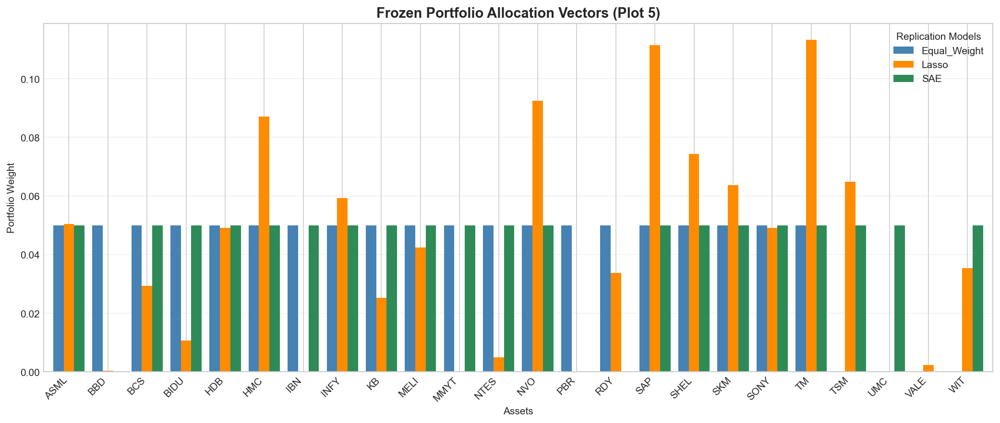
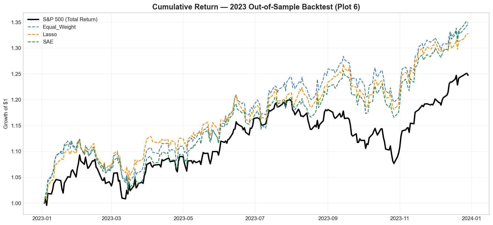
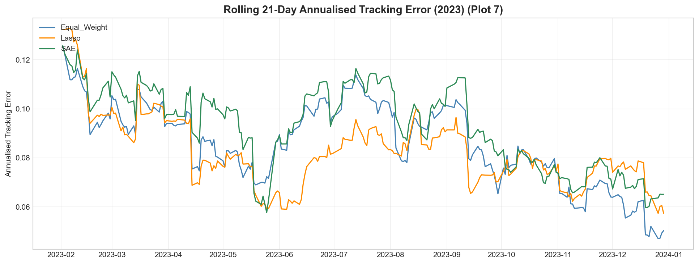

# Synthetic Index Replication Engine

> **Replicate the S&P 500 Total Return Index using 20 liquid Global ADRs — without holding a single US-listed stock.**

A full quantitative pipeline that constructs, backtests, and diagnostics three competing replication strategies: a **Simplex L2 Optimizer** (Lasso), a **Sparse Autoencoder** (SAE), and an **Equal-Weight Baseline**. Trained on 8 years of out-of-sample data, the engine achieves sub-9% annualised tracking error with a correlation above **0.80** to the S&P 500 Total Return benchmark.

---

## Performance Summary (2023 Out-of-Sample)

| Metric | Lasso (Simplex) | Autoencoder (SAE) | Equal Weight |
|---|---|---|---|
| **Tracking Error (Ann.)** | 8.50% | 8.97% | 8.77% | 
| **Correlation** | 0.8029 | 0.8064 | 0.7963 | 
| **Max Drawdown** | **-6.93%** | -9.44% | -8.38% | 
| **Stocks Used** | 20 | 20 | 20 |

**Benchmark**: S&P 500 Total Returns

> All models were trained on 2014–2021 data, validated on 2022, and tested on a completely unseen 2023 out-of-sample period, with strict temporal separation maintained throughout the pipeline to eliminate look-ahead bias.

---

## Architecture

```
synthetic-index-tracker/
│
├── main.py                          # CLI Orchestrator — run any combination of milestones
│
├── src/
│   ├── data_pipeline.py             # Milestone 1: yfinance ingestion, IPO filtering, holiday forward-fill
│   ├── features.py                  # Milestone 2: Temporal partitioning, StandardScaler, hierarchical correlation
│   ├── models_pipeline.py           # Milestone 3: Model training, apples-to-apples K-constraint handshake
│   ├── backtest.py                  # Milestone 4: Friction-adjusted buy-and-hold simulator (ADR tier fees)
│   ├── diagnostics.py               # Milestone 5: Institutional tear sheet, residual distribution, Max DD
│   │
│   └── models/
│       ├── equal_weight.py          # Model A: Top-K equal allocation ranked by training correlation
│       ├── simplex_optimizer.py     # Model B: Scaled L2-penalised Simplex Optimizer (SLSQP, ftol=1e-9)
│       └── sparse_autoencoder.py    # Model C: L1-regularised Latent SAE with early stopping (PyTorch)
│
├── data/                            
│   ├── raw_prices.csv               # Cleaned ADR + S&P 500 closing prices (2014–2023)
│   ├── log_returns.csv              # Continuous log returns for the full universe
│   ├── oos_portfolio_returns.csv    # Combined 2023 daily returns for all three models + benchmark
│   └── final_summary_metrics.csv    # Exported quantitative tear sheet (TE, Sharpe, drawdown, etc.)
│
├── models/                         
│   ├── scaler.pkl                   # Fitted StandardScaler artifact (training-set statistics only)
│   └── frozen_weights_2022.csv      # Locked optimal portfolio weights (T-0 state, val-set selected)
│
└── plots/                           
    ├── instrument_weights.png       # Frozen allocation vectors across all three models
    ├── cumulative_returns.png       # 2023 growth of $1 — all models vs. benchmark
    ├── rolling_tracking_error.png   # Rolling 21-day annualised tracking error (2023)
    └── sae_loss_curve.png           # Daily residual distributions with fitted normals
```

---

## Proxy Universe — 31 Global ADRs

The proxy universe consists of 31 liquid global ADRs spanning major economic regions and sectors. This internationally diversified universe serves as the candidate set from which sparse portfolios are selected to replicate the return profile of the S&P 500.

| Region | Tickers |
|---|---|
| **China / HK** | BABA, JD, BIDU, TME, NTES, PDD |
| **India** | INFY, WIT, HDB, IBN, RDY, MMYT |
| **Latin America** | MELI, VALE, PBR, BBD |
| **Europe** | ASML, NVO, SAP, SHEL, BCS |
| **Japan** | TM, SONY, HMC |
| **Taiwan** | TSM, UMC |
| **South Korea** | SKM, KB |

---

## Pipeline Design Decisions

### Temporal Discipline

The pipeline enforces strict chronological separation between training, validation, and testing periods to eliminate look-ahead bias and ensure a realistic out-of-sample evaluation.

| Split | Period | Purpose |
|---|---|---|
| **Train** | 2014–2021 | Model fitting and scaler calibration |
| **Validation** | 2022 | Hyperparameter selection and portfolio freezing |
| **Test** | 2023 | Fully held-out out-of-sample evaluation |

---

### Consistent Portfolio Cardinality

To ensure a fair comparison across methodologies, the simplex optimizer determines the optimal portfolio sparsity level (**K**) on the validation set. The Equal-Weight and Sparse Autoencoder models are subsequently constrained to the same **K** at inference time, ensuring that differences in performance arise from security selection and weighting methodology rather than portfolio size.

---

### Transaction Cost Model

Backtest performance is adjusted using a tiered ADR transaction-cost framework based on MSCI market classifications.

| ADR Tier | Fee |
|---|---|
| Emerging Market ADRs (China, India, Latin America, Taiwan, Korea) | **15 bps** |
| Developed Market ADRs (Europe, Japan) | **10 bps** |

> Transaction costs are applied as a one-time portfolio entry charge at the beginning of the test period, consistent with a passive buy-and-hold implementation.

---

### Data Quality
Pre-IPO observations for late-listed ADRs are treated as structural missing data and are not imputed. Forward-filling is restricted to short holiday-related gaps (maximum five business days), after which any security with remaining missing values is removed.

---

## Quickstart

### Requirements

```bash
pip install yfinance pandas numpy scipy scikit-learn matplotlib seaborn joblib torch
```

### Run the Full Pipeline

```bash
python main.py --all
```

### Run Individual Milestones

```bash
python main.py --data          # Milestone 1: Download and clean ADR data
python main.py --features      # Milestone 2: Partition, scale, and correlate
python main.py --models        # Milestone 3: Train all three models
python main.py --backtest      # Milestone 4: 2023 out-of-sample simulation
python main.py --diagnostics   # Milestone 5: Tear sheet and residual analysis
```

> Running `main.py` with no flags defaults to `--all`.

---

## Visual Diagnostics

### Frozen Portfolio Allocation Vectors
The Lasso optimizer concentrates capital into a handful of high-signal names — SAP, TM, HMC, and ASML receive the largest tilts — while Equal-Weight and SAE distribute evenly across the same `K=20` asset universe. This heterogeneity in weight structure, despite identical cardinality, is what drives the performance divergence in the backtest.



---

### Cumulative Returns — 2023 Out-of-Sample
All three proxy portfolios outperformed the S&P 500 Total Return benchmark during the 2023 out-of-sample test period. The Simplex Optimized portfolio exhibited the closest co-movement with the benchmark, consistent with its lower realized tracking error. The Equal-Weight portfolio generated the strongest excess return, with its performance advantage widening during the latter part of the year.



---

### Rolling 21-Day Annualised Tracking Error
Tracking error began the year at elevated levels (~12%) for all models before declining into the 6–8% range by May. The Sparse Autoencoder displayed greater dispersion than the Lasso portfolio throughout the test period, while the Lasso model delivered the most stable and consistently lowest tracking error, reflecting its optimization-based construction.



---

### Model Notes

- **Model A — Equal Weight:** Picks the K ADRs that historically moved most like the S&P 500 and gives each an equal allocation. Simple, transparent, and serves as a baseline.

- **Model B — Simplex Optimizer:** Finds the combination of ADR weights that best tracks the S&P 500 while keeping the portfolio diversified and avoiding overly concentrated positions.

- **Model C — Sparse Autoencoder:** Uses a neural network to discover hidden patterns shared across the ADR universe, then identifies the stocks most important for explaining S&P 500 movements and converts those insights into portfolio weights.

---

## Limitations

- Data was sourced from Yahoo Finance and uses adjusted closing prices, which may differ from institutional data providers.
- The backtest assumes a buy-and-hold strategy with no rebalancing; real-world index replication requires periodic portfolio adjustments.
- Outperformance in 2023 was supported by favorable conditions for several non-U.S. ADRs and may not persist in future market environments.
- Taxes, market impact, leverage, short selling, and currency hedging were not considered.
- Securities with incomplete trading histories were excluded, which may introduce survivorship and selection bias into the results.
- The analysis uses **Price Returns** rather than Total Returns, excluding dividend reinvestment. 
- Additionally, the Sparse Autoencoder contains stochastic training components, meaning results may vary slightly between runs unless random seeds are fixed.
---

## Disclaimer

This project is a prototype and developed for educational and research purposes only. The analysis, results, and portfolio constructions presented herein do not constitute financial, investment, or trading advice. Past performance is not indicative of future results, and no representation is made regarding the future performance of any security or strategy.
