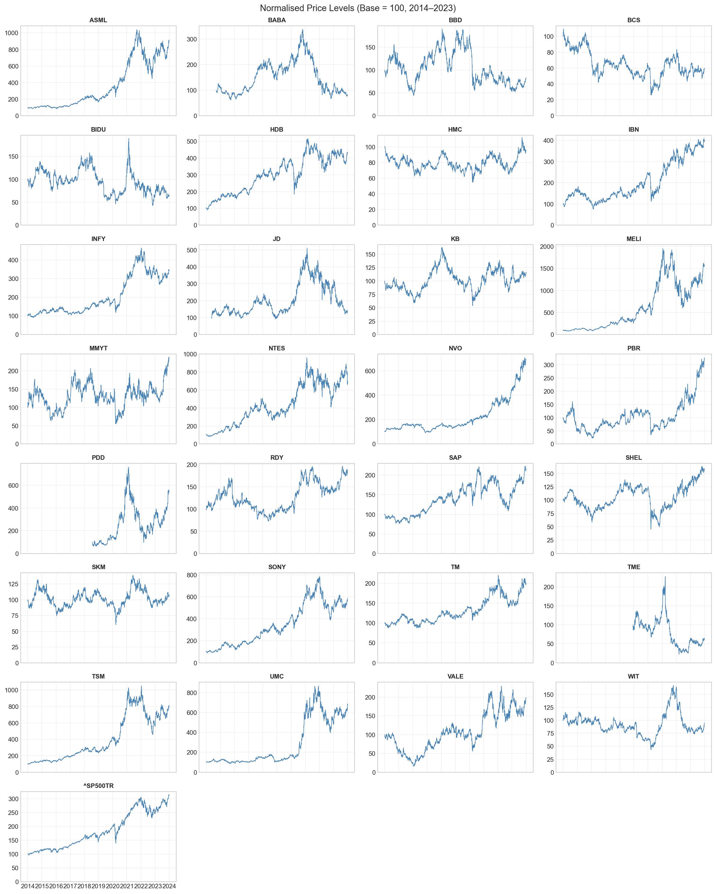
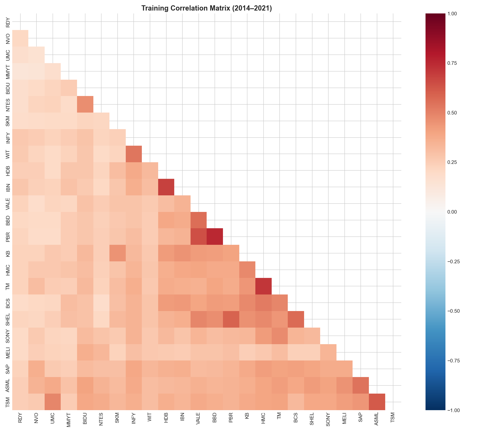
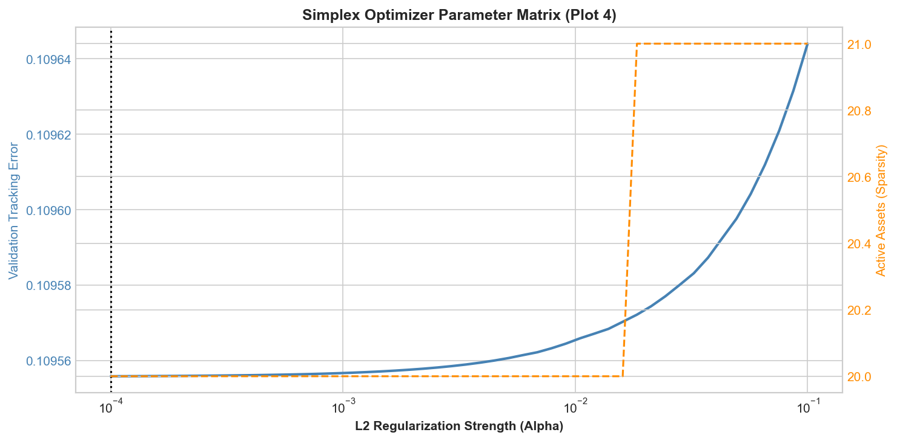
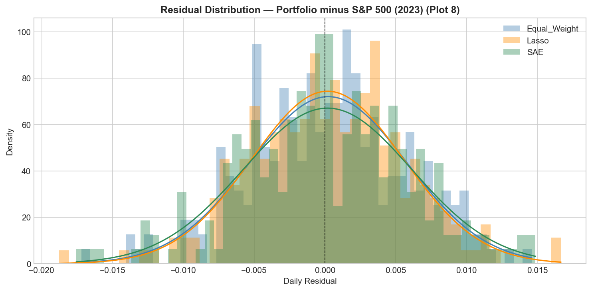
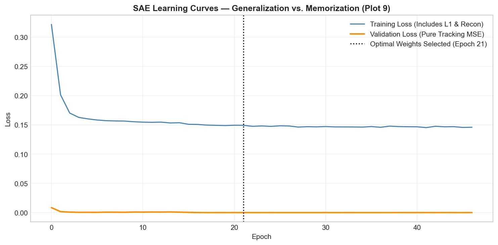

# Synthetic Index Replication Engine  
### Sparse Optimization vs. Deep Latent Models — A Global Index Tracking Benchmark  

> A reproducible quantitative research prototype comparing a classical **Sparse L2 (Lasso) Optimization Model**, a **Sparse Autoencoder (SAE)**, and an **Equal-Weight Baseline** for replicating the S&P 500 Total Return Index using exactly 20 global ADRs.

---

## 1. Executive Summary

This engine evaluates whether a constrained global equity universe (non-US ADRs only) can effectively replicate US equity market beta under strict sparsity and long-only constraints. The models are trained on 2014–2021 data, validated on 2022 data, and benchmarked strictly on a completely unseen 2023 out-of-sample period.

| Model | Tracking Error (Ann.) | Correlation | Max Drawdown |
| :--- | :--- | :--- | :--- |
| **Lasso (Simplex Optimizer)** | **8.50%** | 0.8029 | **-6.93%** |
| **Sparse Autoencoder (SAE)** | 8.97% | **0.8064** | -9.44% |
| **Equal-Weight Baseline** | 8.77% | 0.7963 | -8.38% |

**The Core Insight:** Optimization (Lasso) dominates variance minimization and tail-risk control, while deep representation learning (SAE) extracts superior directional correlation but destabilizes absolute tracking volatility.

---

## 2. The Mathematical Problem

The objective of synthetic index replication is to construct a sparse portfolio weight vector $\mathbf{w}$ that minimizes the variance of the tracking difference against a benchmark $R_b$:

$$\min_{\mathbf{w}} \; \text{Var}(R_p - R_b)$$

Subject to real-world institutional constraints:
1. **Fully Invested:** $\sum w_i = 1$
2. **Long-Only:** $w_i \ge 0 \quad \forall i$
3. **Cardinality / Sparsity:** $\|\mathbf{w}\|_0 \le K \quad (\text{where } K = 20)$

### Core Quantitative Challenges
1. **High-Dimensionality:** Navigating highly correlated cross-asset equity spaces.
2. **Combinatorial Explosion:** Solving the $L_0$ sparsity constraint directly is NP-hard.
3. **Cross-Market Dynamics:** Capturing US market beta using assets exposed to foreign FX and geographic regimes.

---

## 3. Data & Universe Diagnostics (EDA)

The candidate universe consists of 31 liquid Global ADRs across Emerging and Developed markets. 

  
  

**Quantitative Observations:**
* **Intra-Sector Clustering:** Strong positive covariance blocks exist among global semiconductor and technology ADRs.
* **Regional Regimes:** Macro geographic effects dominate the return structure, with emerging markets exhibiting significantly higher volatility dispersion compared to the benchmark.

---

## 4. The Competing Frameworks

### 4.1 Equal-Weight Baseline
A naïve but highly stable reference portfolio:
* Computes historical Pearson correlation to the benchmark.
* Selects the top $K=20$ ADRs and assigns a uniform $1/K$ weight vector.

### 4.2 Sparse L2 Optimizer (Lasso / Simplex)
A constrained mathematical optimization formulation utilizing the SLSQP algorithm:
* **Objective:** Direct minimization of tracking error variance.
* **Regularization:** Employs an L2 penalty to prevent singular matrix inversion failures and ensure weight stability.
* **Sparsity:** Truncates to the top $K$ assets post-optimization and re-normalizes to sum to 1.0.

### 4.3 Sparse Autoencoder (SAE)
A neural representation learning architecture built in PyTorch:
* **Objective:** Learns latent macroeconomic factors embedded across the ADR universe.
* **Regularization:** Applies an L1 penalty directly to the latent space to structurally induce network sparsity.
* **Extraction:** Converts decoder feature importances into the final long-only portfolio weights.

---

## 5. Portfolio Construction Diagnostics

Evaluating the models' internal state at $T-0$ reveals drastically different capital allocation methodologies despite identical cardinality constraints.

  
  

**Quantitative Observations:**
* The **Lasso** optimizer acts as a variance-sink, violently concentrating capital into a handful of high-beta anchors (e.g., ASML, TM, SAP) to offset benchmark volatility.
* The **SAE** and **Equal-Weight** models distribute risk much more uniformly. This heterogeneity in selection drives the entirety of the out-of-sample divergence.

---

## 6. Out-of-Sample Performance (2023)

Evaluated over a completely unseen 252-day trading period, all models successfully replicated the directional drift of the S&P 500, but their tracking stability varied significantly.

  
  

**Quantitative Observations:**
* **Lasso** delivers the tightest and most stable replication trajectory, sustaining the lowest rolling tracking error.
* **SAE** captures the directional moves exceptionally well (highest correlation) but introduces excess tracking volatility.

---

## 7. Statistical Diagnostics

Analyzing the statistical residuals (Tracking Difference) explains the behavioral profiles of the underlying models.

  
  

**Quantitative Observations:**
* **Lasso residuals** are Gaussian-like and tightly bound around zero, confirming it functions as a highly stable, unbiased estimator.
* **SAE residuals** exhibit fatter tails, indicating higher sensitivity to sudden market regime shifts. Deep models inherently trade absolute stability for latent representation power.

---

## 8. Conclusion

Building a direct index tracking engine without domestic equities proves that significant market beta can be captured globally. However, this prototype demonstrates a fundamental quantitative trade-off: **Sparse optimization remains the most reliable approach for index replication stability, while deep learning improves representation quality but increases tail risk.**

The optimal enterprise production system is a **hybrid latent-optimization pipeline**: Utilizing the Sparse Autoencoder purely for regime identification and latent factor extraction, and feeding those structural signals into the Simplex Optimizer to enforce strict drawdown and tracking-error boundaries.

---

