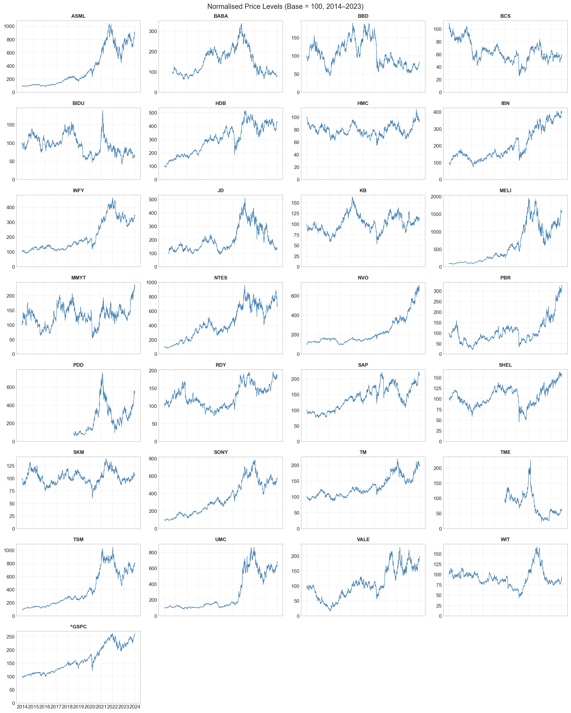
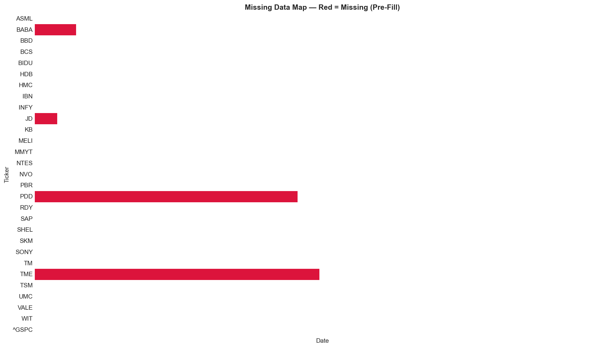
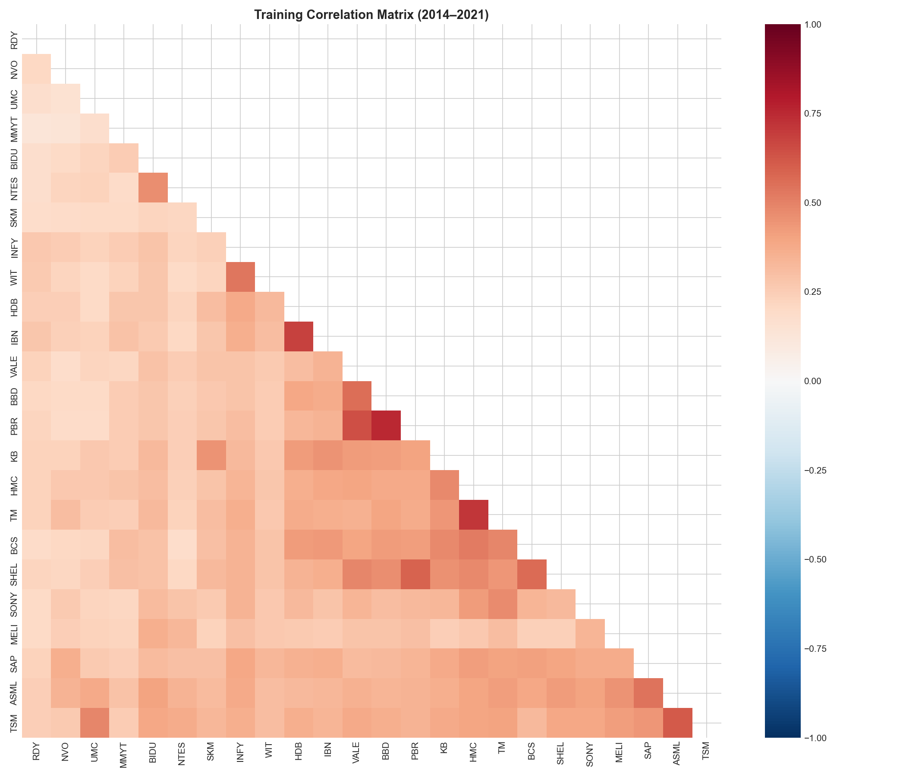
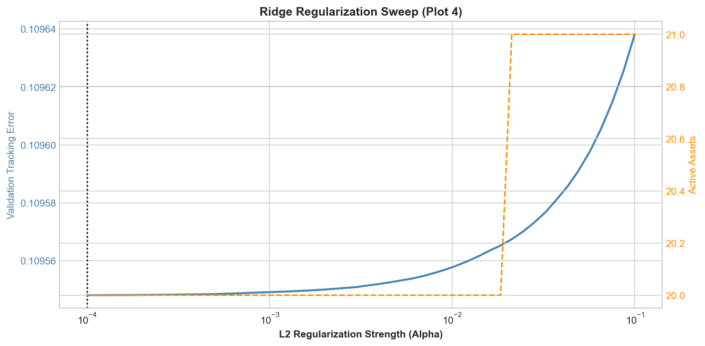
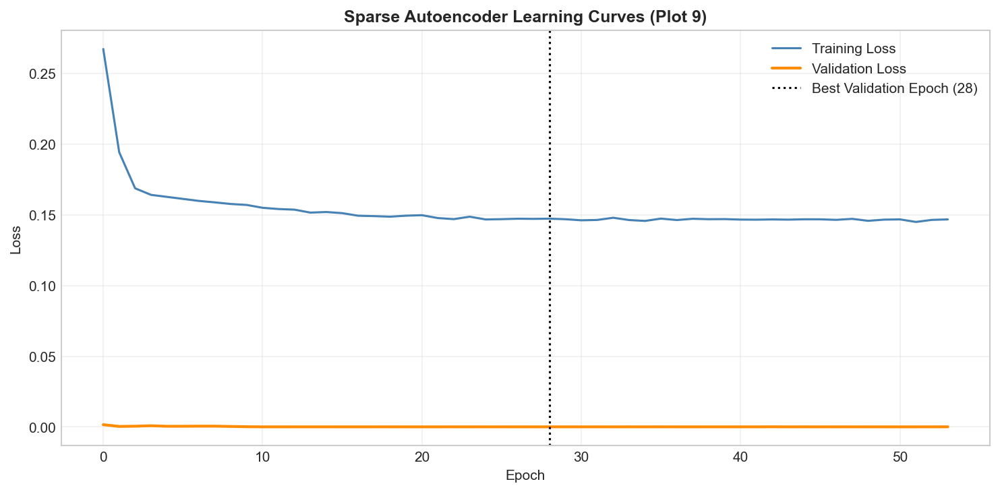
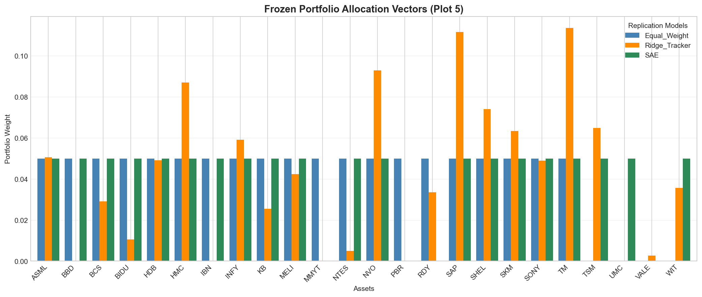
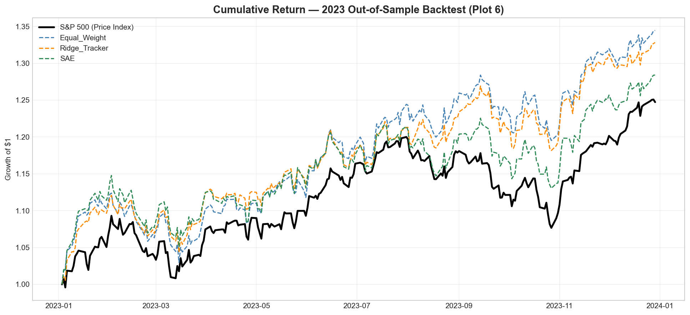
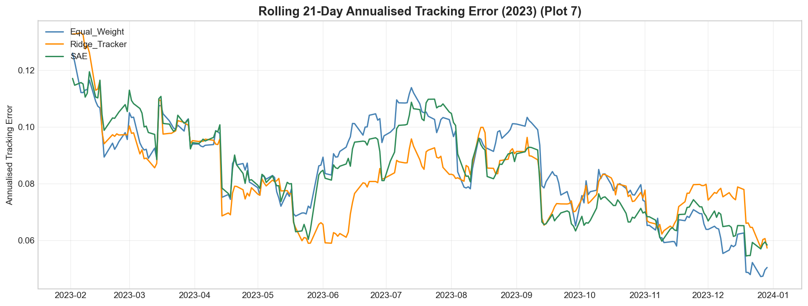

# Synthetic S&P 500 Replication Using Global ADRs

A quantitative portfolio construction framework that replicates the daily return behavior of the S&P 500 using a universe of non-U.S. ADRs. The project compares three portfolio construction methodologies: **Equal Weight Benchmark**, **Ridge-Regularized Simplex Optimizer**, and **Sparse Autoencoder (Deep Learning)**. 

The objective is to determine whether a small portfolio of global equities can synthetically reproduce the return characteristics of a large-cap U.S. equity index.

---

## 1. Project Overview

### Project Motivation
Index replication is a classical portfolio construction problem. Instead of holding all 500 constituents of the S&P 500, this project investigates whether exposure can be approximated using a small set of international ADRs. 

**Applications include:**
| | |
| :--- | :--- |
| Synthetic index construction | Cross-market factor replication |
| Portfolio compression | Tracking-error minimization |
| Sparse portfolio optimization | |

### Research Question
Can the daily return profile of the S&P 500 be replicated using a sparse portfolio of non-U.S. ADRs? Three competing approaches are evaluated:

| Model | Description |
| :--- | :--- |
| **Equal Weight** | Correlation-ranked portfolio with equal allocations |
| **Ridge Tracker** | Convex optimization under simplex constraints |
| **Sparse Autoencoder** | Neural network based latent factor extraction |

---

## 2. Data & Feature Engineering

### Universe Construction
* **Target:** S&P 500 Price Index (`^GSPC`)

| Proxy Universe (29 Global ADRs) | Details |
| :--- | :--- |
| **Regions Spanned** | China / Hong Kong, India, Taiwan, South Korea, Japan, Europe, Latin America |
| **Examples Include** | TSM, ASML, NVO, SAP, INFY, MELI, VALE, TM, SONY |

### Data Pipeline

**Sample Period:**
| Dataset | Period | 
| :--- | :--- | 
| **Training** | 2014 – 2021 | 
| **Validation** | 2022 |
| **Test** | 2023 |

**Processing Steps:**
1. Download adjusted closing prices using Yahoo Finance
2. Align international trading calendars
3. Forward-fill holiday gaps (maximum 5 days)
4. Remove securities with incomplete histories
5. Compute log returns

**Data Quality Diagnostics:**

### Feature Engineering

**Correlation Structure Analysis:**
Hierarchical clustering is applied to identify groups of highly correlated assets.

**Scaling:**
StandardScaler fitted on training data only. 
* **Applied exclusively to:** Sparse Autoencoder
* **Unscaled returns are preserved for:** Equal Weight and Ridge Tracker to maintain portfolio interpretability.

---

## 3. Portfolio Construction Models

### Model A — Equal Weight Benchmark
**Procedure:** (1) Compute asset-target correlations on training data → (2) Rank assets by correlation → (3) Select top-K assets → (4) Allocate equally.
**Advantages:** Simple, transparent, and serves as a robust baseline.

### Model B — Ridge-Regularized Tracker
**Characteristics:** Fully invested, long-only, convex optimization, penalizes concentration.

**Optimization Problem:**
$$\min_w\left[\text{MSE}(Xw-y)+\lambda||w||_2^2\right]$$
**Subject to:**
$$\sum_iw_i=1$$
$$w_i\ge0$$

### Model C — Sparse Autoencoder
**Architecture:** Input Layer → Gaussian Noise → Dropout → Latent Representation (3 Factors) → Tracking Head → Portfolio Weights

**Regularization Parameters:** L1 penalty, Dropout, Gaussian noise, Early stopping.

---

## 4. Backtest Framework

### Backtest Design
* **Evaluation Period:** 2023
* **Portfolio Rules:** Buy and Hold, Long Only, Fully Invested, No Rebalancing

**Transaction Costs:** *(Applied once at portfolio inception)*
| Asset Type | Cost |
| :--- | :--- |
| Developed ADR | 10 bps |
| Emerging ADR | 15 bps |

### Portfolio Allocations
Final frozen portfolio weights used for the out-of-sample backtest.

---

## 5. Results & Key Findings

### Dataset & Portfolio Statistics

| Dataset Metrics | Value | | Portfolio Metrics (Asset Count) | Value |
| :--- | :--- | :--- | :--- | :--- |
| Trading Days | 2515 | | Equal Weight | 20 |
| Final Assets | 25 | | Ridge Tracker | 20 |
| Training Samples | 2014 | | Sparse Autoencoder (SAE) | 20 |
| Validation Samples | 251 | | | |
| Test Samples | 250 | | **Ridge Tracker Validation:** | **10.95% TE** (Opt. Alpha: 0.0001) |

### Performance Evaluation
Metrics tracked include Tracking Error, Correlation, Maximum Drawdown, Residual Sharpe Ratio, and Active Asset Count.

### Key Findings
1. **Global ADRs Contain Significant Information About U.S. Equities:** Even without holding U.S. stocks directly, the model captures a substantial portion of S&P 500 return variation.
2. **Convex Optimization Produces Stable Portfolios:** The Ridge Tracker generated the lowest validation tracking error while maintaining diversification.
3. **Deep Learning Does Not Automatically Outperform Simpler Methods:** The Sparse Autoencoder discovers latent factors, but increased model complexity does not guarantee superior replication performance.
4. **Portfolio Compression is Possible:** A relatively small portfolio of ADRs can reproduce a broad equity index with reasonable accuracy.

---

## 6. Limitations & Future Work

### Limitations
* **Survivorship Bias:** The proxy universe is selected using present-day ADR listings. Delisted ADRs and historical constituents are excluded.
* **Static Parameters:** The asset universe remains fixed, and weights are frozen at the end of 2022 (held throughout 2023 without re-optimization or rebalancing).
* **Transaction Cost Simplification:** Modeled using fixed basis-point assumptions. Actual execution costs depend on market impact, liquidity conditions, and bid-ask spread dynamics.
* **Price Index Benchmark:** The benchmark uses the S&P 500 Price Index (`^GSPC`) rather than a Total Return Index, meaning dividend effects are ignored.

### Future Enhancements

**Model & Factor Upgrades**
* Elastic Net regularization
* Alternative latent-factor architectures
* Black-Litterman integration
* Hierarchical Risk Parity comparison

**Portfolio & Benchmark Upgrades**
* Dynamic portfolio rebalancing & Rolling retraining
* Total-return benchmark replication
* Multi-objective optimization (tracking error + turnover)

---
